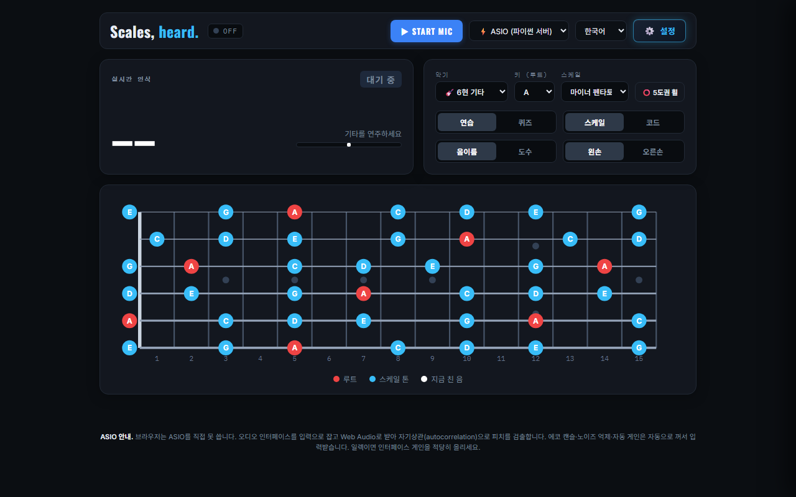
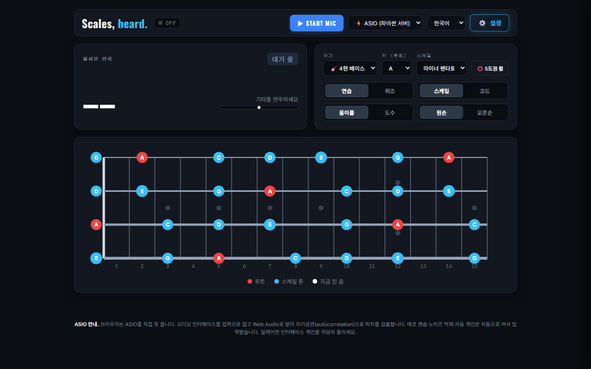
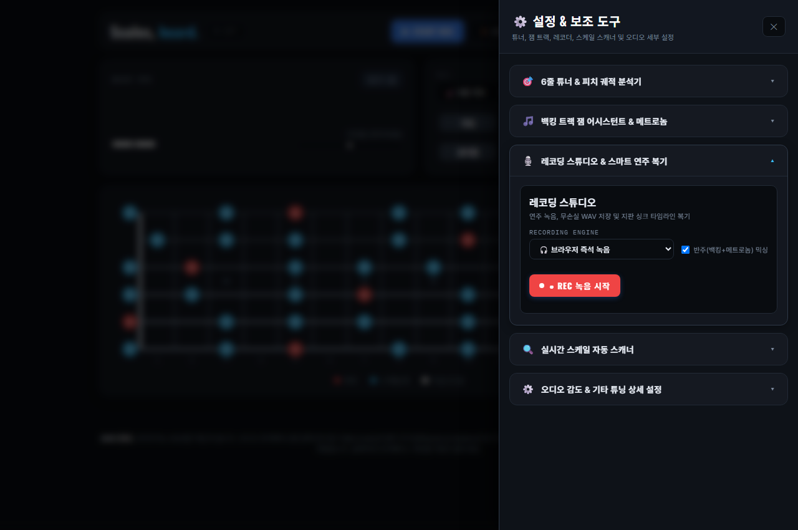

# Scales, heard. 🎸

A powerful, ultra low-latency fretboard **scale guide & practice studio** in the browser and desktop that **listens to your real electric & bass guitar** in real-time.

[](https://github.com/ManofKimchi08/guitar-scale-tuner/releases)
[](LICENSE)
[]()

---

## 📸 Screenshots & UI Tour

| 🎸 6-String Guitar Fretboard & HUD |
| :---: |
|  |

| 🎸 4-String Bass Guitar (Thick Wound Strings & 1-5-8 Groove Guide) | 🎙️ 3-Tier Recording Studio & Performance Replay |
| :---: | :---: |
|  |  |

---

## 🌟 Key Features (v2.1.0)

### 1. 🎸 6-String Guitar & 4-String Bass Support
- **Dual Instrument Engine**: Instant toggle between `🎸 6-String Guitar` and `🎸 4-String Bass`.
- **30.0Hz Sub-Bass Detection**: Extends pitch detection down to B0 (30.87Hz), Drop D (36.7Hz), and E1 (41.2Hz) with auto-switching 4096 FFT buffers.
- **1-5-8 Groove Interval Guide**: Visual amber rings accent the Root (1st), 5th, and Octave (8th) positions essential for bassists.

### 2. 🎙️ 3-Tier Recording Studio & Smart Scorecard
- **Tier 1 (Instant Browser REC)**: One-click recording of guitar audio directly into memory. Supports optional simultaneous mixing of **backing tracks & metronome**. Export as DAW-ready 16-bit lossless `.wav`.
- **Tier 2 (ASIO Studio Lossless)**: Direct 32-bit Float PCM disk streaming to `recordings/ASIO_Take_*.wav`.
- **Tier 3 (Smart Analysis & Synced Replay)**: Automated performance scorecard computing **Total Notes**, **Scale Accuracy (%)**, and **Pitch Stability (%)**. Includes an interactive **Synced Fretboard Replay** that animates your original fingering and HUD meter in lockstep with the recorded audio.

### 3. 🎛️ Adaptive Sample Rate Negotiation (Zero PaErrorCode -9997)
- **Automatic Hardware Rate Detection**: Probes device native sample rates (`48000Hz`, `44100Hz`, `96000Hz`, etc.) and automatically adapts stream configurations on Windows WASAPI, ASIO, DirectSound, and USB Audio CODECs.
- **Dynamic DSP Re-computation**: Recalculates FFT bin width and NNLS harmonic dictionary matrices on the fly, guaranteeing 100% pitch accuracy regardless of sample rate.

### 4. ⚡ High-Performance Hybrid Audio Engine
- **Single-Process Dual-Thread**: Bundles local HTTP server and WebSocket ASIO engine into a lightweight background process.
- **DOM Thrashing Elimination**: Fretboard SVG structure is rendered once and cached; dynamic note changes execute via $O(1)$ CSS class toggles.
- **Multilingual Support**: Fully localized in 한국어 (Korean), English, and 日本語 (Japanese).

---

## 🚀 Quick Start

### Option A: Windows One-Click Executable (Recommended)
Download and run `GuitarScaleTuner.exe` from [Releases](https://github.com/ManofKimchi08/guitar-scale-tuner/releases). No installation or Python required.

### Option B: Run from Source
1. Clone the repository:
   ```bash
   git clone https://github.com/ManofKimchi08/guitar-scale-tuner.git
   cd guitar-scale-tuner
   ```
2. Install Python dependencies:
   ```bash
   pip install numpy sounddevice websockets
   ```
3. Launch the unified engine:
   ```bash
   python GuitarScaleTuner.py
   ```
   *Your browser will automatically open `http://localhost:8000`.*

---

## 📖 Deep-Dive Technical Documentation

For in-depth mathematical formulations, DSP algorithms, coordinate descent NNLS chroma solver, and complete architecture diagrams, please read:

👉 **[docs/TECHNICAL_DOCUMENTATION.md](docs/TECHNICAL_DOCUMENTATION.md)**

---

## 🛠️ Project Structure

```
guitar-scale-tuner/
├── GuitarScaleTuner.py       # Unified entrypoint (Daemon HTTP + ASIO WebSocket)
├── asio_server.py            # Adaptive sample rate sounddevice capture & NNLS solver
├── run_https_server.py       # Path-traversal safe local HTTP web server
├── build_exe.py              # PyInstaller Windows executable packager
├── index.html                # Responsive studio GUI markup
├── src/
│   ├── main.js               # Web Audio API, SVG fretboard renderer, 3-Tier REC
│   ├── style.css             # Dark studio glassmorphism theme
│   ├── i18n.js               # Multi-language dictionary (KR / EN / JP)
│   └── favicon.svg           # High-resolution vector brand icon
├── docs/
│   ├── TECHNICAL_DOCUMENTATION.md  # Engineering whitepaper & DSP spec
│   └── screenshots/          # High-resolution UI screenshots
├── favicon.ico / favicon.png # Windows binary & web application icons
└── recordings/               # Output directory for ASIO lossless WAV takes
```

---

## 📄 License

Distributed under the [MIT](LICENSE) License. Free to use, modify, and distribute for personal and commercial projects.
